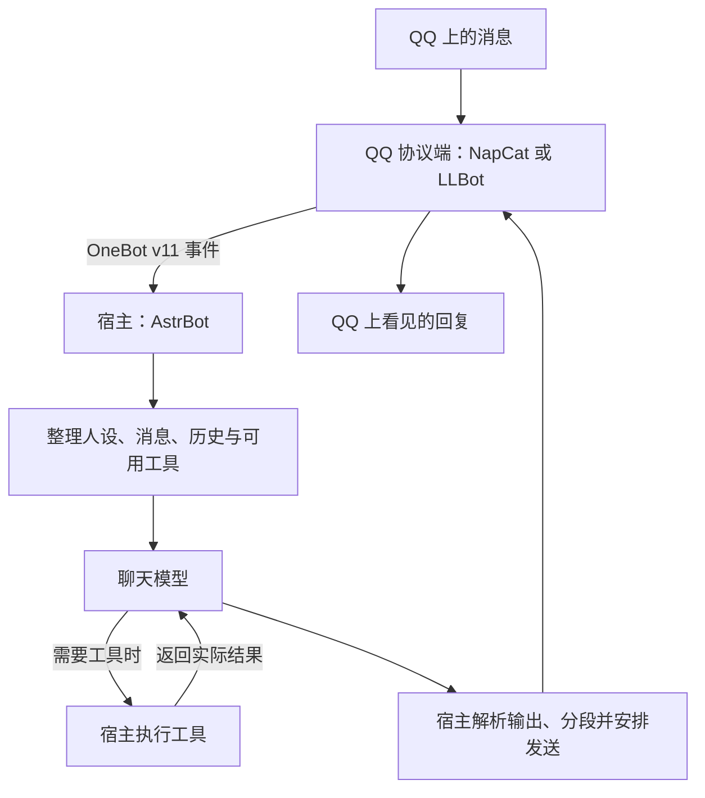

# 2. QQ 聊天背后的整条链路

[上一章](01-what-we-want.md) · [目录](../README.md) · [下一章：消息节奏](03-host-and-turns.md)

先把几个容易混在一起的名字拆开。以本书的安装实例为例：



图中是职责划分，不代表每次聊天都会调用工具，也不是模型内部的思考步骤。

## 四种角色，不要混称为“模型”

| 名称 | 在这条链路里负责什么 |
| --- | --- |
| QQ 协议端 | 连接 QQ，把消息事件交给应用，并执行发送等平台动作 |
| AstrBot 这样的宿主 | 管理会话、模型、角色、插件、工具与消息输出 |
| 模型服务 | 接收本次请求包含的材料，生成文字或工具调用请求 |
| 人设提示词 | 告诉模型人物、关系、表达方向与适用边界 |

例如，模型生成了三段话，QQ 上却显示五个气泡，先看输出处理；机器人根本没收到消息，先看接入；工具没有注册，先看宿主配置。它们不应都被诊断成“人设不够强”。

## OneBot、aiocqhttp、NapCat 是什么关系

[OneBot v11](https://github.com/botuniverse/onebot-11) 是机器人应用接口标准，定义事件和 API 等约定。

[aiocqhttp](https://github.com/nonebot/aiocqhttp) 是相关 Python SDK；AstrBot 的接入文档、日志和配置里也会出现这个名称。说“通过 aiocqhttp 接入 QQ”在交流中常见，但这里使用的接口协议是 **OneBot v11**，不是一种叫 aiocqhttp 的独立 QQ 协议。

[NapCatQQ](https://github.com/NapNeko/NapCatQQ) 和 [LuckyLilliaBot / LLBot](https://github.com/LLOneBot/LuckyLilliaBot) 则是可选协议端。核对时，[LLOneBot 旧仓库入口](https://github.com/LLOneBot/LLOneBot)已跳转到 LuckyLilliaBot；旧教程里的名称、运行方式和当前 LLBot 不应直接混用。LLBot 当前 README 列出了 OneBot 11、Satori、Milky 支持，本书讨论的是其中与 AstrBot OneBot v11 接入相配的路径。

换协议端时，不必同时更换人设与模型。但要重新验证图片、引用、撤回、输入状态通知和主动发送；“都支持 OneBot”不等于每项扩展行为和兼容性完全相同。

## AstrBot 如何接入

[AstrBot 的 OneBot v11 文档](https://docs.astrbot.app/platform/aiocqhttp.html)说明了反向 WebSocket 接入方式：

```text
NapCat / 相应协议端：WebSocket 客户端
                       ↓ 主动连接
AstrBot：WebSocket 服务端
```

“反向”不是消息只能单向传输，而是连接建立的方向。典型目标地址是 `ws://astrbot:6199/ws`，这里的 `astrbot` 只适用于两个容器处在同一 Docker 网络、服务名可解析的情况。

如果两者不在一个网络里，这个名字就不一定可用；如果你在 NapCat 容器里填 `127.0.0.1`，通常指向 NapCat 容器自己，而不是另一个容器。第 7 章会用一个明确的拓扑说明这些地址。

其他协议端只要满足实际接入要求，也可以使用。不要仅凭项目宣传中的“兼容”就跳过测试。

另外，AstrBot 还提供 [QQ 官方机器人入口](https://docs.astrbot.app/platform/qqofficial.html)。它与个人号协议端不是同一条路径，账号类型、接口权限和交互体验应按官方接入文档单独判断，不能直接套本书的个人号容器配置。

## 一次回复，其实有三种单位

后面排查问题时，请分清：

1. **一次模型请求**：宿主把一份上下文交给模型；工具往返可能增加调用。
2. **一份生成结果**：模型为这次输入生成的内容，可能是完整文本，也可能分块流出。
3. **用户看到的气泡**：宿主和平台处理后实际发出的消息。

它们没有固定的一一对应关系。十个气泡可能来自一份生成结果；一条最终回复也可能经历过多次工具调用。

这也是为什么只凭聊天截图，不能判断模型调用了几次，更不能判断中途有没有收到你新发的消息。

## 给问题找到负责的位置

可以沿这条最短路径观察：

```text
QQ 实际发了什么
  → 协议端上报了什么
  → AstrBot 实际传给模型什么
  → 模型原始生成了什么
  → QQ 最后显示了什么
```

日常不需要一直开着详细日志。但出了问题，先找第一个发生偏差的位置，比给人设补一句“认真理解用户”更有用。

本章依据：[AstrBot](https://github.com/AstrBotDevs/AstrBot)、[OneBot v11 接入文档](https://docs.astrbot.app/platform/aiocqhttp.html)、[LLBot](https://github.com/LLOneBot/LuckyLilliaBot)、[NapCatQQ](https://github.com/NapNeko/NapCatQQ)。具体快照见[来源索引](../sources/README.md)。
