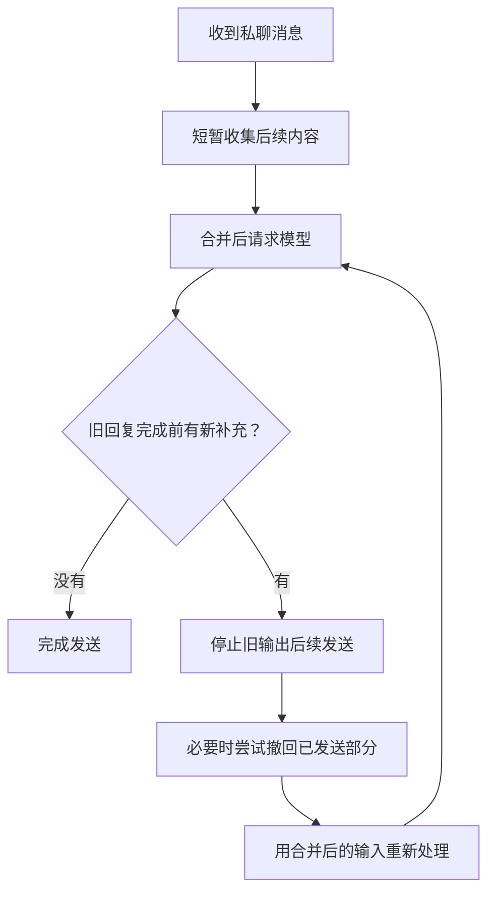

# 3. 宿主先学会等人说完

[上一章](02-the-stack.md) · [目录](../README.md) · [下一章：表情包](04-memes-and-images.md)

QQ 上的人不总是把一句话写完整再发送。

```text
用户：我刚想说
用户：今晚可能不去了
用户：外面雨太大了
```

如果每条消息都立即触发一次模型请求，就可能得到三份彼此重叠的回答。再把每份回答拆成几条、加上发送间隔，聊天窗口里就会排起队。

用户已经改口，机器人却还在慢慢说上一版的话。界面看起来像真人正在打字，底层却没有同样的随时改口能力。

这里真正要改善的不是“让机器人多等几秒”，而是让一次聊天回合更接近私聊的节奏：用户还在补充时，系统尽量别急着把半句话当成完整意图；模型已经开始生成后，等待过程要有合适的反馈；旧回复失效时，后续消息不要继续把过时内容排队送出。输入合并、输入状态和发送控制分别对应这三件事，不能用一个开关代替全部。

## 分段不是重新思考

在常见的请求式调用中，模型依据这一次请求里已有的上下文生成。你后来在 QQ 发的新消息，不会因为它尚未生成完或尚未发送完，就自动加入这一次上下文。宿主需要实际接收、组织并重新处理这些变化。

流式输出只改变内容怎样逐步到达；拆气泡只改变怎样显示。它们本身都不等于“听着你说话，随时调整剩下的回答”。

分段的价值也主要在**阅读节奏**。一整段很长的文字一次性砸进私聊，会像系统公告；适度拆开，用户更容易在中途插话，也更接近日常聊天窗口的视觉节奏。但分段器只是在已有文本上找切点，不能替模型删掉多余的关心、停止错误的追问，或者把已经过时的内容变回来。因此先判断原文是否值得发送，再判断怎样切气泡。

因此，“你一句，机器人好多句等着发”有时并不是单纯话多，而是**轮次组织不对称**：

- 用户可以连续补充，旧请求却仍按之前的信息工作。
- 模型可能早已生成完，宿主还在按间隔发送。
- 对话已经转向，旧队列没有作废。

人可以补一句“等等，我说错了”，也可能撤回消息；机器人是否能做类似动作，取决于宿主、协议端和具体实现，不是模型天然具有的功能。

## 分段、流式与过滤怎么选

想让一段回复在 QQ 里分成几条，可以先关掉流式输出，再打开 AstrBot 的“分段回复”。普通分段先按回复文本找切点，再对切出的每条应用内容过滤；过滤能删掉标点或空白，却不能改变切点。流式输出有自己的发送方式，不能指望它再按同一条分段正则拆气泡。

需要按标点、引号或换行切分时，可以试[这份正则示例](../examples/astrbot-segment-regex.txt)，把文件中的一整行填进“分段回复”的正则设置。比如 `你好，今天怎么样？` 可以显示为 `你好，` 和 `今天怎么样？`。先用自己喜欢的回复试几条：逢逗号就断，也可能把一句自然的话切得太碎。


引号与其中的短句一起显示，方便对照分段效果。

内容过滤可以先留空。如果只想去掉**每条气泡首尾**的句号和空白，同时保留正文里的空格，可填：

```regex
^[。\s]+|[。\s]+$
```

不要把 `[。\s\r\n ]` 当成等价写法，它还会清掉正文中的空格，让 `hello world` 变成 `helloworld`。看最终 QQ 气泡再决定要不要过滤。

## 先解决三个不同的问题

| 问题 | 对应能力 | 不能替代什么 |
| --- | --- | --- |
| 人还没说完，机器人已经答了 | 输入防抖、连续消息合并 | 不判断所有内容的真实意图 |
| 人改口了，旧回复仍在发送 | 旧轮次失效、取消后续发送、按新输入处理 | 不保证上游模型停止计费 |
| 旧回复已有一部分发出 | 平台支持时尝试撤回，或保留并自然纠正 | 不会让读过的消息变成没看过 |

只有输出本身不合适时，才需要进一步检查模型和人设。哪怕回复很短，过时内容照样可能造成误解；哪怕回复很长，只要是你愿意听的一段话，也不必为了数量而删掉。

## “正在输入”是界面状态

你发完消息，过了几秒，聊天窗口毫无动静。即使回复最终很好，这几秒也像对方突然消失了。QQ 标题下方出现“对方正在输入…”时，等待成了对话的一部分：你知道对面正在回应。这是很小的界面变化，却比再给人设加一句“说话像真人”更直接。


在 AstrBot 中，[input_state_by_nc](https://github.com/ctrlkk/astrbot_plugin_input_state_by_nc) 可以在处理 OneBot 私聊请求时上报这个状态。名字虽带 NapCat，其他支持 `set_input_status` 的 OneBot 协议端也可能显示；实际效果看协议端与 QQ 客户端。安装后发一条普通消息，看等待时是否出现、回复后是否消失。它只负责等待时的可见状态；用户补发消息后的合并和旧回复停止，仍是另外的能力。

## TurnFlow：动态防抖与拟人撤回

[TurnFlow](https://github.com/Yuimi-chaya/astrbot_plugin_turnflow) 是面向 AstrBot 私聊的动态防抖与撤回插件，作者也维护这个项目。它对应本章开头的那段私聊：人还在补充时，机器人先等一等；人已经改口时，别让旧话继续往外发。

动态防抖给连续输入留出补充的时间，再把这几条一起交给模型。若机器人尚未说完，用户又发来更正，它会阻止旧回复继续发送；对已经发出的部分，在平台允许时尝试像人收回说错的话那样撤回，再按新内容处理。这让等待、改口和撤回属于同一段互动，而不只是把气泡发得慢一点。

这处理的是回合与发送节奏，不会让模型自动理解它从未收到的新消息；已完整发完的回复也不会因下一条消息自动撤回。




用户的几条补充先出现，机器人随后接成一条回复。需要确认实际请求次数时再看宿主记录。

当前 README 中，基础等待默认 2 秒，整轮收集默认最多 30 秒，动态防抖会调整实际等待。这些是该版本的默认值，不是本书推荐所有人固定使用的数值；收集上限也不包含图片转述和模型生成时间。

### 怎么安装和验证

先保证 AstrBot 已能正常私聊。在插件管理中使用 TurnFlow 仓库地址安装，保持默认配置开始；不要同时启用另一份接管同一链路的防抖或中断插件。

然后试四件事：

1. 连发几条组成一句话，观察是否合并，而不是分别回答。
2. 在等待期间撤回其中一条，观察撤回内容是否不再参与回答。
3. 在回复尚未结束时补充“刚才说错了”，观察旧输出是否停止、新回复是否按更正处理。
4. 等一份回复完整发送后，再发新消息，确认它不会撤回上一份已经结束的回复。

这四步要在你实际使用的流式、非流式或分段方式下试；若验证的是上面的正则，务必用**非流式**路径。只在 WebUI 里看到一个漂亮结果，不足以证明 QQ 发送链路已经正确。

### 哪些事不要期待过头

TurnFlow 不会事后自动改写所有已完成的回答。撤回受平台权限和可识别的消息范围影响；其他插件绕开正常事件链单独发送的消息，也不保证能捕获。

中断可能只是丢弃迟到结果或禁止继续发送，不能据此认定模型服务端已经停止计算。工具已经创建的提醒、写入的文件等副作用，也不能靠撤回聊天气泡自动撤销。

插件 README 明确保留了版本与第三方组合的验收边界。因此，安装一个插件是增加了可用机制，不是提前得到“所有情况都能自然打断”的保证。

## 不想装插件，也先做这个检查

保留人设不变，暂时关闭或缩短人工分段延迟，在测试会话里比较：

- 是原始文本本来就讲了太多？
- 还是内容并不多，只是发送拖得很久？
- 新消息进来以后，旧结果是否还继续送出？

第一项偏向内容选择，后两项偏向宿主调度。不要用同一个气泡上限同时修这三种问题。

参考：[输入状态插件源码](https://github.com/ctrlkk/astrbot_plugin_input_state_by_nc/blob/5efb843aaaa2280c24e4874de086ddad31cbe3b4/main.py)、[TurnFlow README 与边界](https://github.com/Yuimi-chaya/astrbot_plugin_turnflow/blob/87a79b69948d407605d58a7a375125790b736a6d/README.md)。

---

[上篇：QQ 聊天背后的整条链路](02-the-stack.md) · [目录](../README.md) · [下篇：表情包也是完整的回应](04-memes-and-images.md)
