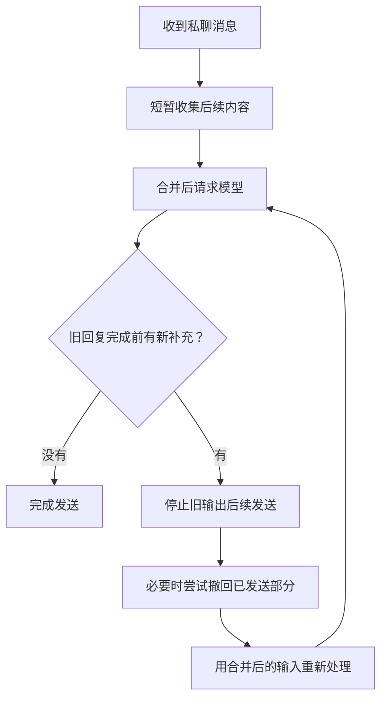

# 3. 宿主先学会等人说完

[上一章](02-the-stack.md) · [目录](../README.md) · [下一章：表情包](04-memes-and-images.md)

QQ 上的人不总是把一句话写完整再发送。

```text
用户：我刚想说
用户：今晚可能不去了
用户：外面雨太大了
```

如果每条消息都立即触发一次模型请求，就可能得到三份彼此重叠的回答。再把每份回答拆成几条、加上发送间隔，聊天窗口里就会排起队。

用户已经改口，机器人却还在慢慢说上一版的话。界面看起来像真人正在打字，底层却没有同样的随时改口能力。

## 分段不是重新思考

在常见的请求式调用中，模型依据这一次请求里已有的上下文生成。你后来在 QQ 发的新消息，不会因为它尚未生成完或尚未发送完，就自动加入这一次上下文。宿主需要实际接收、组织并重新处理这些变化。

流式输出只改变内容怎样逐步到达；拆气泡只改变怎样显示。它们本身都不等于“听着你说话，随时调整剩下的回答”。

因此，“你一句，机器人好多句等着发”有时并不是单纯话多，而是**轮次组织不对称**：

- 用户可以连续补充，旧请求却仍按之前的信息工作。
- 模型可能早已生成完，宿主还在按间隔发送。
- 对话已经转向，旧队列没有作废。

人可以补一句“等等，我说错了”，也可能撤回消息；机器人是否能做类似动作，取决于宿主、协议端和具体实现，不是模型天然具有的功能。

## 流式、分段与内容过滤不是同一件事

以核对过的 [AstrBot 输出处理源码](https://github.com/AstrBotDevs/AstrBot/blob/67c74b7ed8d5b8df170f849faaa431fc329c4ddc/astrbot/core/pipeline/result_decorate/stage.py)为例，普通的“分段回复”工作在非流式结果上。模型的回复进入发送前处理后，宿主对待分段的纯文本消息段运行正则匹配，再对**每一段**应用“内容过滤正则表达式”，清掉空段，最后按设置的间隔发送。过滤是在决定分段边界之后做的，不能反过来改变正则在哪里切；但如果把某一段清空，它也可能不再成为可见气泡。图片等非纯文本消息段不按这个正则拆。

这不表示过滤永远是整个发送链路的最后一步，也不表示正则直接作用于模型 API 返回的原始字节：发送前插件和回复前缀可能先改动待分段文本，之后还有语音、图片等处理。这里的“内容过滤”专指 `platform_settings.segmented_reply.content_cleanup_rule`，不是模型内容安全过滤。

开启“流式输出”时，流式结果走[另一条发送路径](https://github.com/AstrBotDevs/AstrBot/blob/67c74b7ed8d5b8df170f849faaa431fc329c4ddc/astrbot/core/pipeline/respond/stage.py)，不经过上面这套完成后 `re.findall` 分段及逐段过滤。因此想靠**分段正则**控制 QQ 气泡时，先关掉流式再测。在不支持流式的平台上，AstrBot 另有“实时分段回复”回退选项：它边收到流式内容边寻找断点，并不是把完成后的同一正则和过滤重新启用。配置里同时看到“流式”和“分段”开关，不代表两条规则会串行生效。

在 AstrBot 的配置中可找到“流式输出”和“扩展功能 → 分段回复”（界面位置随版本变化）。分段默认关闭；启用后可选“仅对 LLM 结果分段”、正则表达式或分段词列表，以及发送间隔。当前源码的**字数阈值默认 150**：单个纯文本段超过阈值就不分段，也不会在此分段分支应用内容过滤。设完以后先拿原始文本做对照，别把阈值挡住的测试误判为正则失效。

需要细调标点时，[这份可复制的正则示例](../examples/astrbot-segment-regex.txt)会按中英文逗号、句号、问号、感叹号、多点省略号与换行匹配，也尝试在上引号/前括号前、下引号/后括号后留出边界。它是在使用者提供的样式上补入了原式遗漏的 `，,` 和括号，并非 AstrBot 默认值。实际配置填**文件里的一整行**，不要把 Markdown 围栏一起填进去。AstrBot 用 Python `re.findall(..., re.DOTALL | re.MULTILINE)`，所以编排时避免意外添加捕获组；有分组需求用 `(?:...)`。

例如，它把 `你好，今天怎么样？` 分成 `你好，` 和 `今天怎么样？`；把 `唔...\n你还醒着吗？` 的换行作为边界，清洗后仍能得到两条正文。`\n` 是实际换行对应的转义写法，不是 `/n`。聊天里逗号本来很密，逢逗号必断可能把自然的一句话拆得很碎；先拿你实际喜欢的回复试，不必为了显得“像 QQ”而打开所有断点。

内容过滤可以先留空。如果只是想去掉**段首尾**的句号和空白，同时保留英文词之间的空格，可填：

```regex
^[。\s]+|[。\s]+$
```

使用者提供的 `[。\s\r\n ]` 也合法，但它会移除段中**所有**空白，不只是边缘：`hello world` 会变成 `helloworld`，有空格的代码与地址也可能受损。`\s` 本身已包含常见空格和换行，后面的 `\r\n ` 又重复覆盖了部分字符。过滤不会改变已选出的切点，却会改变气泡内容；完成分段后仍要检查 QQ 真正显示什么。

## 先解决三个不同的问题

| 问题 | 对应能力 | 不能替代什么 |
| --- | --- | --- |
| 人还没说完，机器人已经答了 | 输入防抖、连续消息合并 | 不判断所有内容的真实意图 |
| 人改口了，旧回复仍在发送 | 旧轮次失效、取消后续发送、按新输入处理 | 不保证上游模型停止计费 |
| 旧回复已有一部分发出 | 平台支持时尝试撤回，或保留并自然纠正 | 不会让读过的消息变成没看过 |

只有输出本身不合适时，才需要进一步检查模型和人设。哪怕回复很短，过时内容照样可能造成误解；哪怕回复很长，只要是你愿意听的一段话，也不必为了数量而删掉。

## “正在输入”是界面状态

等模型生成时，QQ 如果能显示“对方正在输入…”，等待会有一个可见信号。[input_state_by_nc](https://github.com/ctrlkk/astrbot_plugin_input_state_by_nc) 虽以 NapCat 命名，代码实际判断的是 AstrBot 的 OneBot 私聊事件，再向所接协议端调用 `set_input_status`；在 LLM 请求期间持续上报，回复处理前还会补报一次。它不让模型更快，也不会合并用户补发的消息或取消已排队的旧回复；显示了“正在输入”，不表示机器人能像人一样边看新消息边改正在生成的答案。

非 NapCat 的 OneBot 协议端也有实际可用的情况；关键是当前实现能否处理 `set_input_status`，以及 QQ 客户端是否显示。这个动作并非 OneBot v11 基本接口规定的通用能力，所以也不宜反过来保证每个协议端都能用。安装后在自己的私聊里试一次正常生成、一次超时或中断，再看输入状态能否正常结束；不要让它和长时间分段发送一起造成“还在输入”却持续发旧内容的错觉。

## 一个可选实现：TurnFlow

[TurnFlow](https://github.com/Yuimi-chaya/astrbot_plugin_turnflow) 是面向 AstrBot 私聊的防抖与动态撤回插件。作者也维护这个项目，下面按已核对 README 描述其能力，不将其当成唯一方案。

它在收集阶段短暂等待并合并后续消息；在旧回复尚未完成时收到补充，会使旧输出失效，结合更新后的输入重新处理。有已捕获的部分消息时，尝试通过平台撤回，并对失效回复的历史做带保护的回滚。



这是行为概览，不是插件的完整状态机；并发、迟到结果和历史保护还需要代码处理。

当前 README 中，基础等待默认 2 秒，整轮收集默认最多 30 秒，动态防抖会调整实际等待。这些是该版本的默认值，不是本书推荐所有人固定使用的数值；收集上限也不包含图片转述和模型生成时间。

### 怎么安装和验证

先保证 AstrBot 已能正常私聊。在插件管理中使用 TurnFlow 仓库地址安装，保持默认配置开始；不要同时启用另一份接管同一链路的防抖或中断插件。

然后试四件事：

1. 连发几条组成一句话，观察是否合并，而不是分别回答。
2. 在等待期间撤回其中一条，观察撤回内容是否不再参与回答。
3. 在回复尚未结束时补充“刚才说错了”，观察旧输出是否停止、新回复是否按更正处理。
4. 等一份回复完整发送后，再发新消息，确认它不会撤回上一份已经结束的回复。

这四步要在你实际使用的流式、非流式或分段方式下试；若验证的是上面的正则，务必用**非流式**路径。只在 WebUI 里看到一个漂亮结果，不足以证明 QQ 发送链路已经正确。

### 哪些事不要期待过头

TurnFlow 不会事后自动改写所有已完成的回答。撤回受平台权限和可识别的消息范围影响；其他插件绕开正常事件链单独发送的消息，也不保证能捕获。

中断可能只是丢弃迟到结果或禁止继续发送，不能据此认定模型服务端已经停止计算。工具已经创建的提醒、写入的文件等副作用，也不能靠撤回聊天气泡自动撤销。

插件 README 明确保留了版本与第三方组合的验收边界。因此，安装一个插件是增加了可用机制，不是提前得到“所有情况都能自然打断”的保证。

## 不想装插件，也先做这个检查

保留人设不变，暂时关闭或缩短人工分段延迟，在测试会话里比较：

- 是原始文本本来就讲了太多？
- 还是内容并不多，只是发送拖得很久？
- 新消息进来以后，旧结果是否还继续送出？

第一项偏向内容选择，后两项偏向宿主调度。不要用同一个气泡上限同时修这三种问题。

参考：[输入状态插件源码](https://github.com/ctrlkk/astrbot_plugin_input_state_by_nc/blob/5efb843aaaa2280c24e4874de086ddad31cbe3b4/main.py)、[TurnFlow README 与边界](https://github.com/Yuimi-chaya/astrbot_plugin_turnflow/blob/87a79b69948d407605d58a7a375125790b736a6d/README.md)。本章没有宣称已经完成你所用平台组合的联调。
