# 7. 实例：AstrBot + NapCat + 宝塔

[上一章](06-models.md) · [目录](../README.md) · [下一章：记忆与工具](08-memory-and-tools.md)

这一章按宝塔的图形界面走一遍完整链路：

```text
QQ
  → NapCat
  → OneBot v11 / WebSocket
  → AstrBot
  → 模型服务
  → AstrBot
  → NapCat
  → QQ
```

目标不是先把所有插件装齐，而是先完成一次最小闭环：QQ 发消息，NapCat 收到，AstrBot 调用模型，回复再回到 QQ。原教程中的宝塔、AstrBot、NapCat 和日志截图都按操作顺序放在下面，页面文字会随版本变化，但要找的字段基本相同。

为什么要从这条最小闭环开始？因为它是后面所有体验判断的参照物。闭环没跑通时，你看到的“不回复”可能是网络、账号、协议或模型配置；闭环跑通后，再接入人设、图片、分段和主动消息，才知道新增能力到底改善了什么。如果一开始同时安装一堆插件，出了问题只能看到一个“机器人很怪”，很难知道是哪一层造成的。

## 先看四个端口

| 端口 | 用途 | 浏览器是否直接打开 |
| --- | --- | --- |
| `6185` | AstrBot WebUI | 是，例如 `http://服务器IP:6185` |
| `6099` | NapCat WebUI | 是，例如 `http://服务器IP:6099/webui` |
| `6199` | AstrBot 的 OneBot v11 反向 WebSocket | 不是网页，用来让协议端连接 AstrBot |
| `3000 / 3001` | NapCat 的可选服务 | 按你的 NapCat 配置决定 |

`6185` 和 `6099` 是管理页面，`6199` 是聊天事件的连接入口。浏览器打开 `http://服务器IP:6199`，不会得到 AstrBot 管理页。

如果 AstrBot 和 NapCat 在同一个 Docker 网络，NapCat 可以用 AstrBot 的容器名或服务名，也可以直接用 AstrBot 在这个网络里的容器 IP：

```text
ws://astrbot:6199/ws
ws://<AstrBot容器IP>:6199/ws
```

这里的 IP 是**容器在共享网络中的 IP**，不是服务器公网 IP；容器重建后可能变化，长期配置优先用名称。同网络连接无需把 `6199` 发布到宿主机。

如果两个容器不在同一网络，可以发布 `6199` 到宿主机，再用宿主机地址：

```text
ws://服务器IP:6199/ws
```

此时还要让连接来源能够到达该地址和端口。别把容器 IP、宿主机 IP 与管理页面端口混在一起。

## 1. 准备服务器与端口

这一节的目的不是把所有端口都开放，而是先确定谁需要被浏览器访问、谁只需要在容器网络内部通信。管理页面和 OneBot 连接入口承担的工作不同；只把它们都映射到公网，既增加暴露面，也会让后面排错时分不清访问失败发生在哪里。

你需要：

- 一台能运行 Docker 的 Linux 云服务器；
- 已经可以登录的宝塔面板；
- 一个用于登录协议端的 QQ 账号；
- 一个可用的模型服务和 API Key；
- 浏览器。

个人 QQ 协议端可能受到账号风控和平台规则影响。先使用自己愿意承担风险的测试账号，确认项目说明和平台规则后再登录。

云服务器的安全组或上游防火墙、宝塔管理的系统防火墙、Docker 的端口发布是三层不同位置。三层都要与当前拓扑一致：

1. 云服务器控制台允许访问的来源和端口。
2. 宝塔“安全”页面中的系统防火墙规则。
3. 容器是否把端口发布到宿主机，以及发布到了哪个地址。

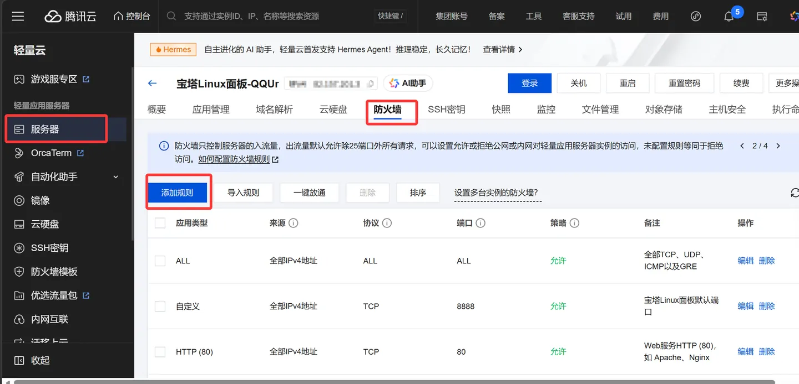

在云平台添加规则时，选择 TCP，端口填实际要从外部访问的端口。直接测试时通常需要 `6185` 和 `6099`；只有协议端容器不在 AstrBot 的 Docker 网络中时，才需要让 `6199` 从外部可达。

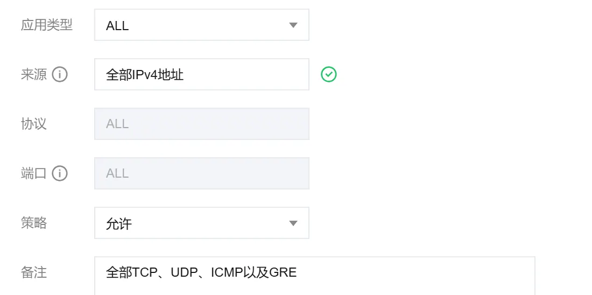

不要把全部端口长期放开。先让页面和连接跑通，再把来源范围收紧到自己的 IP、内网或 VPN。

## 2. 在宝塔准备 Docker

宝塔在这里的价值，是把容器、网络、卷和日志变成可以逐项检查的界面。它降低了第一次部署的门槛，但不会自动替你设计安全的网络拓扑；所以仍要知道每个页面操作对应 Docker 中的哪一层。

进入宝塔的应用管理或 Docker 模块。

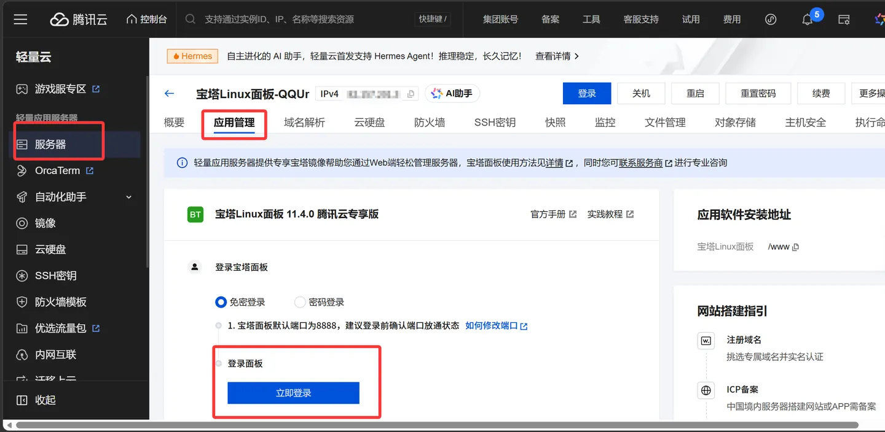

如果还没有 Docker 模块，先安装它。

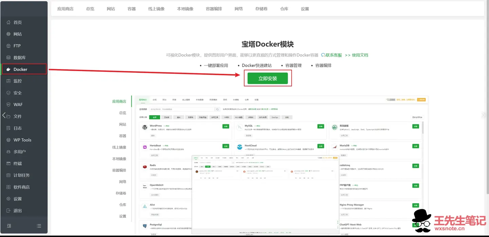

打开 Docker 页面后，确认应用商店、容器、镜像、网络和容器编排等入口都能使用。后面会分别用到“应用商店”和“容器”两个页面。

## 3. 安装 AstrBot

先把 AstrBot 单独启动，是为了验证宿主本身能打开、能保存数据、能调用模型。此时 QQ 还没有加入，任何错误都更容易归到宿主或模型配置，而不是协议端。

### 用应用商店安装

在 Docker 应用商店搜索 AstrBot。

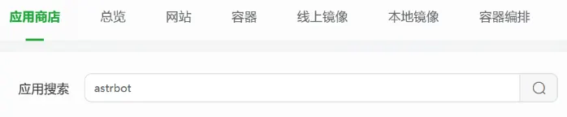

点击安装后，检查容器名称、版本和服务端口。AstrBot WebUI 默认使用 `6185`。

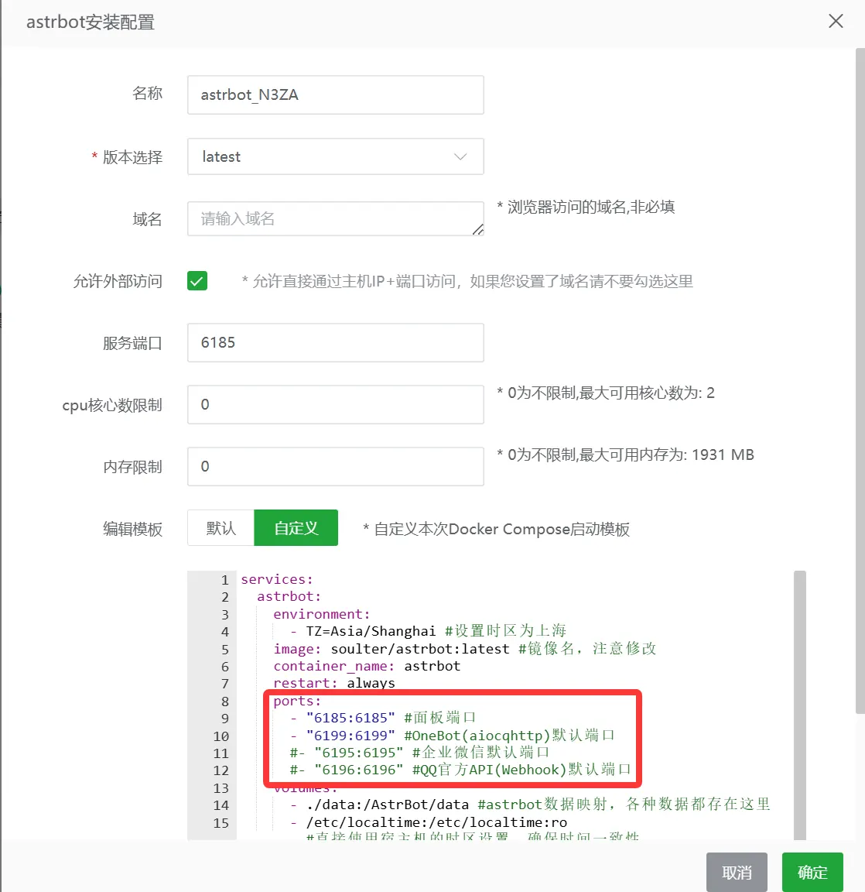

镜像版本可以先用当前项目提供的稳定标签；如果你要长期运行，记录实际使用的标签或摘要，升级时更容易复现。

安装完成后先看容器日志。

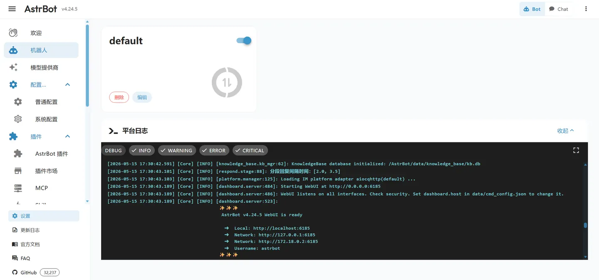

### 用容器编排安装

也可以在宝塔“容器编排”里创建 AstrBot。下面的截图展示了编排页面中的端口、数据目录和网络位置：

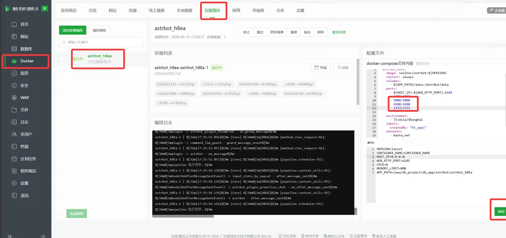

本书提供了一份可编辑的[双容器 Compose 示例](../examples/astrbot-napcat/compose.yaml)。其中：

- `6185` 用于 AstrBot WebUI；
- `6099` 用于 NapCat WebUI；
- 两个服务加入同一个 Docker 网络；
- `6199` 只在需要从宿主机或另一个网络连接时发布；
- `data/`、NapCat 配置和 QQ 登录数据需要持久化。

这份示例的 `ADMIN_BIND_IP` 默认是 `127.0.0.1`，适合配合反向代理或本地隧道使用。若要直接打开 `http://服务器IP:6185` 和 `http://服务器IP:6099/webui`，在确认云安全组和宝塔防火墙已经限制来源后，把它改成服务器可达的绑定地址，例如 `0.0.0.0`；只改防火墙而不改绑定地址，页面仍然只监听本机。

如果采用应用商店安装 AstrBot，记下它实际加入的 Docker 网络名称，创建 NapCat 时把 NapCat 加入同一网络。

### 打开 AstrBot WebUI

如果需要从服务器外部直接访问 `6185`，在宝塔“安全”中放行它。

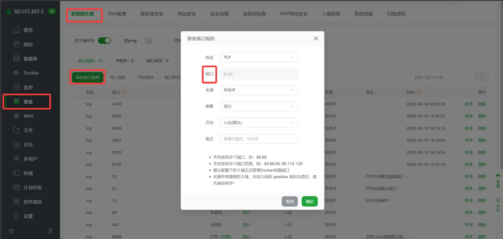

浏览器打开：

```text
http://服务器IP:6185
```

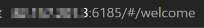

首次进入后完成 AstrBot 的初始化。

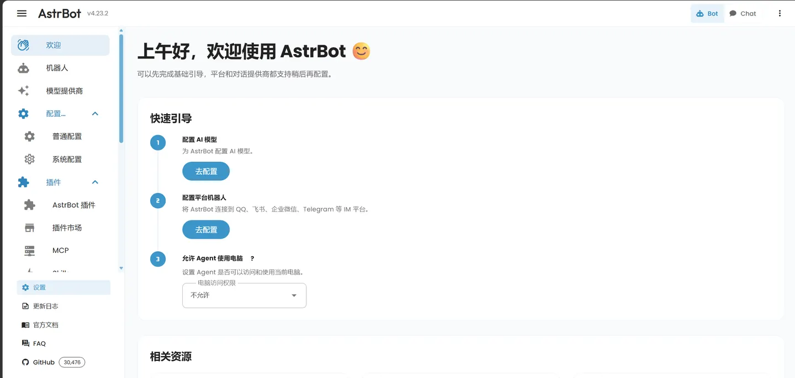

## 4. 创建 NapCat 容器

NapCat 负责把 QQ 账号接入 OneBot，和 AstrBot 是两个角色。把它单独放进同一条 Docker 网络，目的是让它们通过内部服务名通信，不必为了容器之间的连接把 `6199` 暴露到公网；管理 NapCat WebUI 的端口则是另一件事。

回到宝塔 Docker 的“容器”页面，点击“创建容器”，选择“手动创建”。

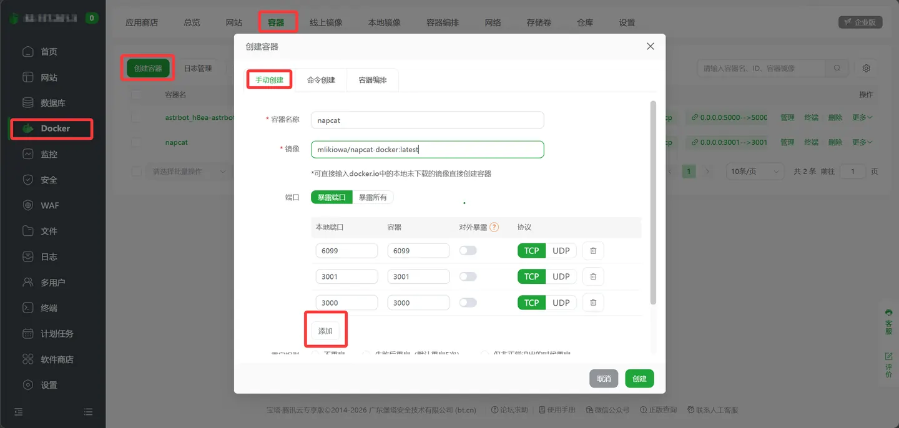

填写容器名称、当前可用的 NapCat-Docker 镜像和端口。截图中的端口对应关系是：

| 本地端口 | 容器端口 | 用途 |
| --- | --- | --- |
| `6099` | `6099` | NapCat WebUI |
| `3001` | `3001` | NapCat 可选服务 |
| `3000` | `3000` | NapCat 可选服务 |

`6099` 要发布到宿主机，才能用浏览器打开 NapCat WebUI。`3000` 和 `3001` 是否发布，按你当前使用的功能决定。

如果界面提供“挂载”或“卷”设置，把配置和登录数据放到容器外。书中 Compose 示例使用：

| 宿主机目录 | 容器目录 | 用途 |
| --- | --- | --- |
| `./data` | `/AstrBot/data` | AstrBot 数据与共享媒体 |
| `./napcat/config` | `/app/napcat/config` | NapCat 配置 |
| `./ntqq` | `/app/.config/QQ` | QQ 登录数据 |

不同 NapCat 镜像的容器路径可能不同；如果当前镜像文档给出了不同路径，以镜像文档为准。没有持久化这些目录，重建容器后就可能丢失配置或登录状态。

创建时在网络设置中选择 AstrBot 所在的用户自定义 Docker 网络。若宝塔把两个容器放进了同一个网络，后面可以使用 AstrBot 的服务名或容器名连接 `6199`，不需要把 `6199` 暴露到公网。

如果两个容器已经启动但网络不同，到宝塔 Docker 的“网络”页面把 NapCat 连接到 AstrBot 所在的网络，再重启 NapCat。

## 5. 登录 NapCat

创建完成后，打开 NapCat 容器日志，找到 WebUI 地址和登录 token。

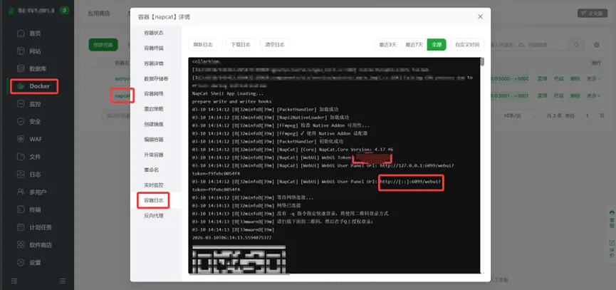

在浏览器打开日志给出的地址，常见形式是：

```text
http://服务器IP:6099/webui
```

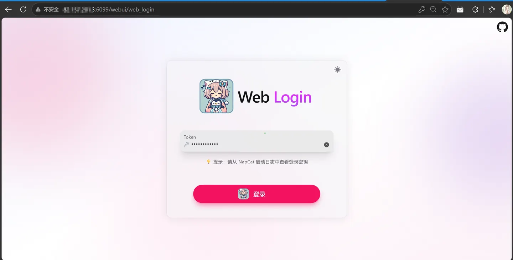

登录后进入基础信息页。

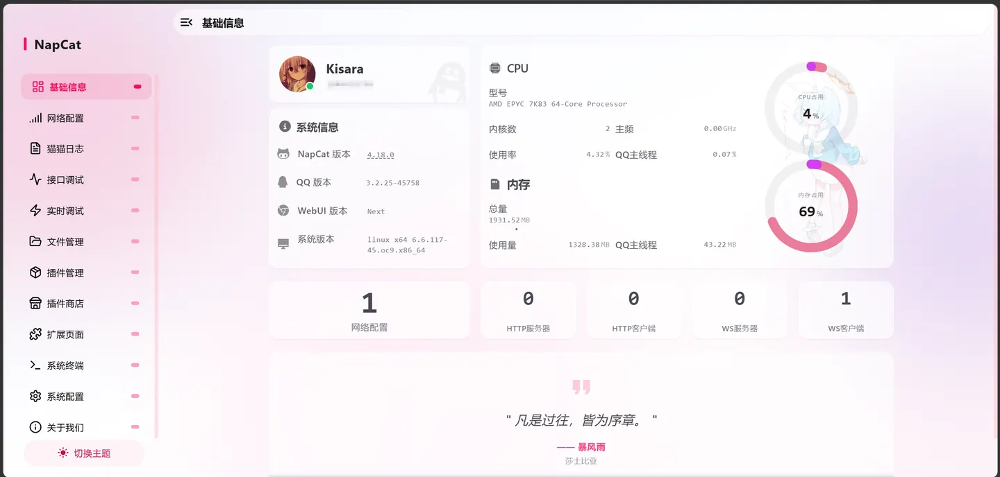

接着按 NapCat 页面提示登录 QQ。扫码、验证码和设备确认都需要由账号持有者完成。

## 6. 配置模型

模型配置放在 QQ 链路之前单独验证，是为了先回答一个基本问题：宿主能不能用这份 API Key 和模型 ID 生成一次正常回复。这样做不是多走一步，而是把“模型服务不可用”和“OneBot 没接上”拆成两个可判断的问题。

QQ 链路还没接好时，可以先在 AstrBot 内把模型单独测通。进入“模型提供商”或欢迎页里的模型配置入口。

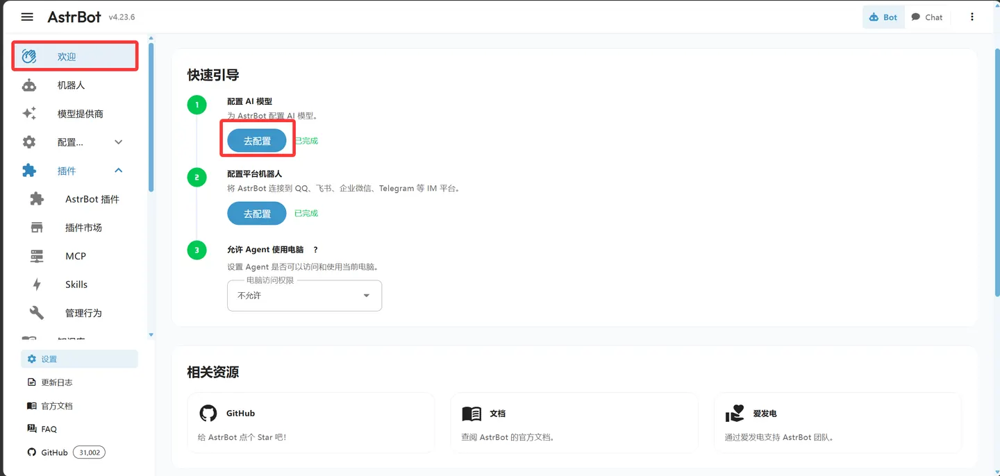

选择服务商。截图以 DeepSeek 为例，使用其他 OpenAI Compatible 服务时，填写对应的 API Base URL 和模型 ID。

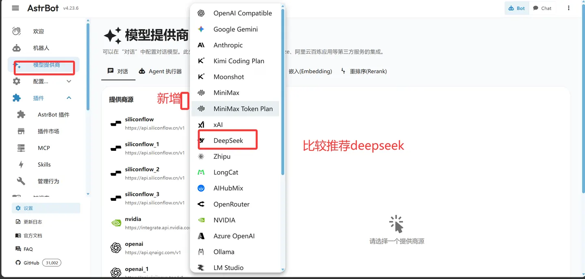

在服务商控制台创建 API Key。

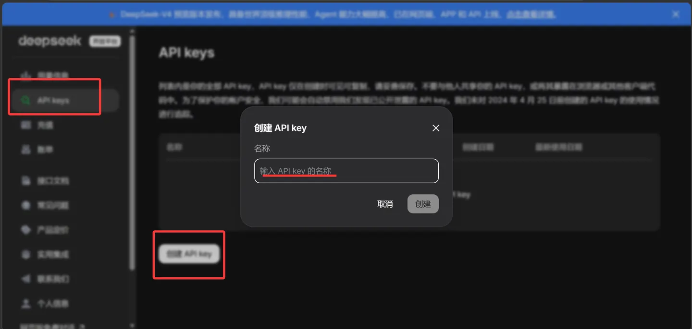

创建完成后立即复制并保存。截图中的 key 只用于展示复制位置，不要把自己的 key 放进截图或聊天记录。

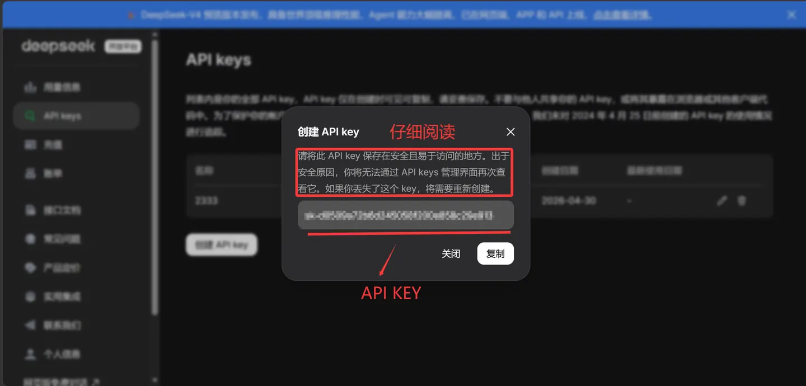

回到 AstrBot，填写 API Key 和 Base URL。

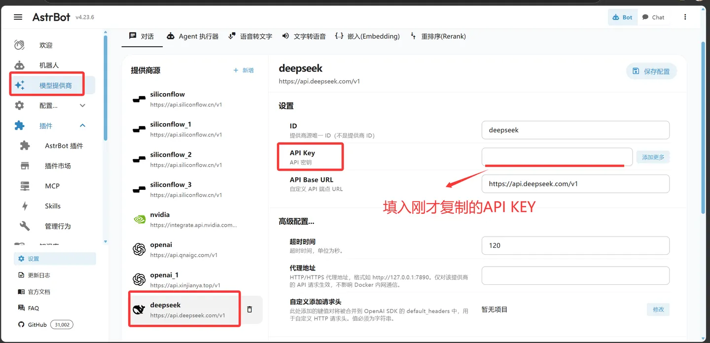

接着获取模型列表。

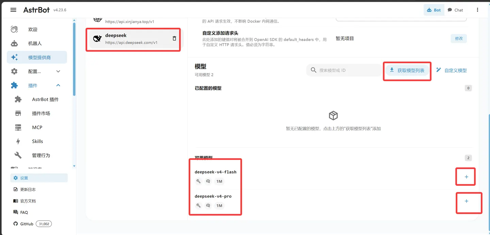

将需要使用的模型加入配置。

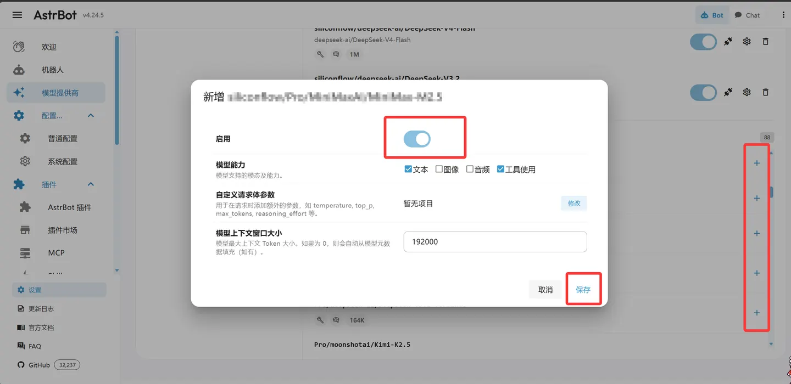

最后选择默认 LLM。

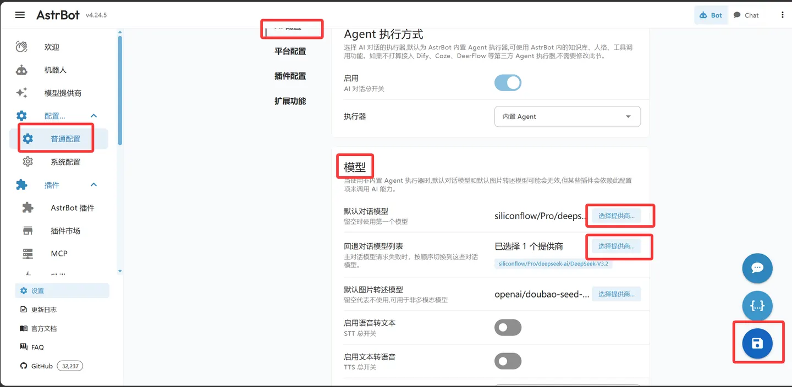

先在 AstrBot 的聊天入口发一句普通消息。只有模型单独返回正常，才继续排查 QQ 链路；这样能把 API Key、余额、模型 ID 和网络问题与 OneBot 问题分开。

## 7. 创建 AstrBot 的 OneBot v11 入口

这一步是在 AstrBot 里开一个“协议端把 QQ 事件送进来的门”。它不负责登录 QQ，也不是模型服务地址；把监听地址、连接地址和管理页面混用，是部署时最常见的概念错误之一。

在 AstrBot 的“机器人”页面创建机器人，平台类型选择 `OneBot v11`。

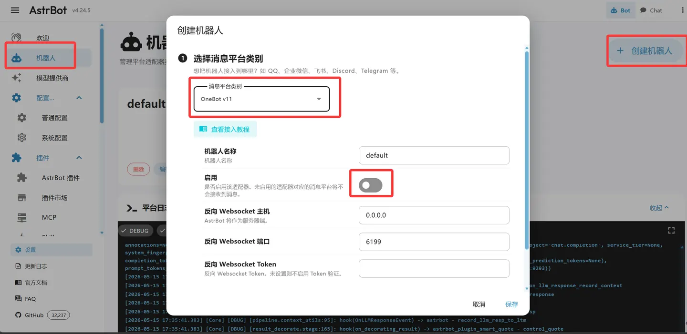

按下面填写：

| 字段 | 填写 |
| --- | --- |
| 机器人名称 | 自己能认出的名称，例如 `qq-napcat` |
| 启用 | 打开 |
| 反向 WebSocket 主机 | `0.0.0.0` |
| 反向 WebSocket 端口 | `6199` |
| 反向 WebSocket Token | 填一个随机值 |

这里的 `0.0.0.0` 是 AstrBot 在容器内监听所有网卡，不是 NapCat 要填写的连接地址。OneBot Token 两边必须完全一致；它与 NapCat WebUI token、模型 API Key 是三种不同凭据。

如果 NapCat 与 AstrBot 在同一 Docker 网络，`6199` 可以只在容器网络内使用。如果 NapCat 在别的网络，才在 AstrBot 容器中发布 `6199:6199`，然后按服务器 IP 和防火墙规则连接。

## 8. 让 NapCat 连接 AstrBot

进入 NapCat 的“网络配置”，点击新建，选择“Websocket 客户端”。

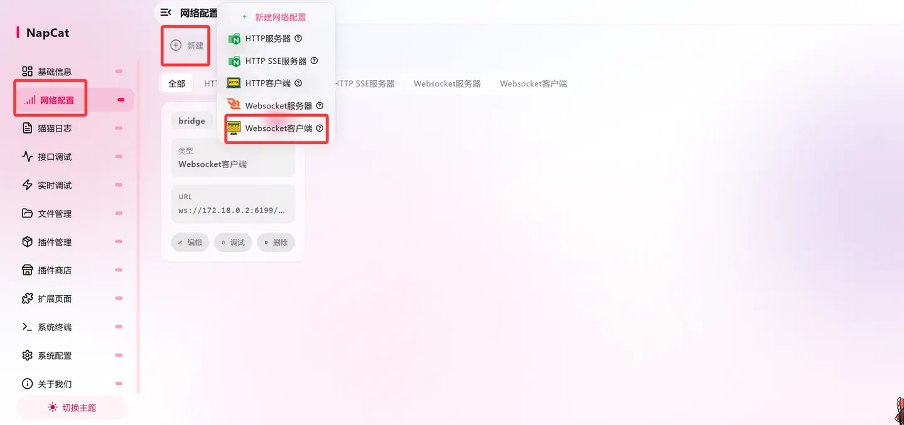

启用配置，填写 URL 和 Token。

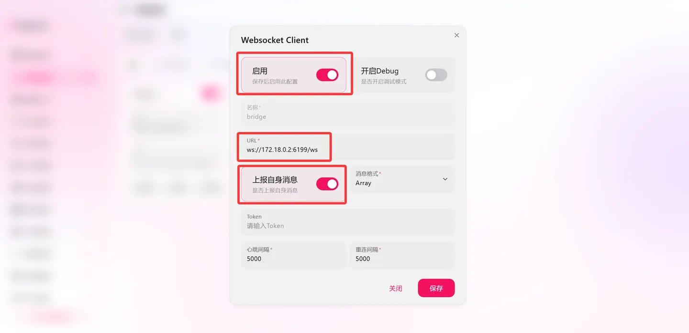

根据网络拓扑选择 URL：

```text
# 两个容器在同一个 Docker 网络
ws://astrbot:6199/ws
ws://<AstrBot容器IP>:6199/ws

# 两个容器不在同一个 Docker 网络，使用宿主机发布的端口
ws://服务器IP:6199/ws
```

`astrbot` 必须替换成宝塔里实际可解析的 AstrBot 服务名或容器名。使用共享网络中的容器 IP 也能连接，但容器重建后 IP 可能变化。

保存后回到 AstrBot 日志，看到 OneBot v11 / aiocqhttp 适配器连接成功。

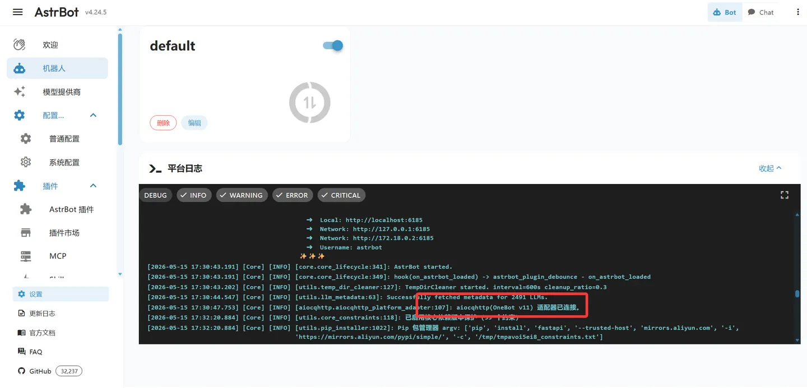

如果连接失败，按这个顺序检查：

1. NapCat 和 AstrBot 是否真的处于同一个 Docker 网络。
2. 同网络连接时，容器名是否能解析。
3. `6199` 是否为 AstrBot 容器内监听端口。
4. 外部连接时，`6199` 是否发布、云防火墙和宝塔防火墙是否允许。
5. URL 是否带有 `/ws`。
6. 两边 OneBot Token 是否完全一致。

## 9. 从 QQ 走一遍完整测试

最后这次测试的意义，是确认一条真实消息完成了完整往返，而不是只证明某个管理页面能打开。按日志顺序看事件从哪里开始、在哪一步消失，通常比反复点击“重启容器”更快定位问题。

用另一个 QQ 账号给 bot 发一句“你好”。

先看 QQ 是否收到回复：

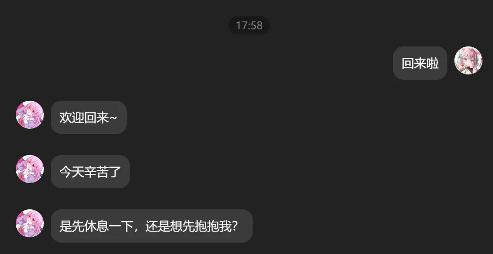

再按链路顺序检查日志：

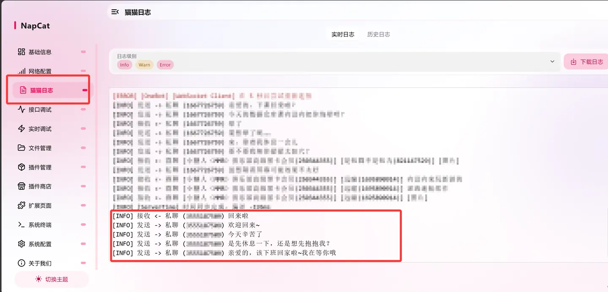

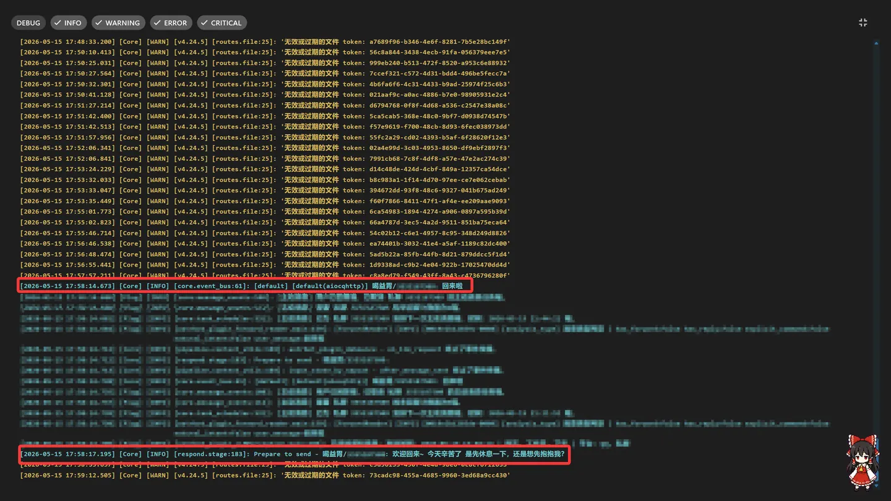

一条消息完整通过时，应该能依次看到：

1. QQ 把消息交给 NapCat。
2. NapCat 通过 OneBot 上报给 AstrBot。
3. AstrBot 调用默认模型。
4. 模型返回文本或工具请求。
5. AstrBot 将结果交给 NapCat。
6. QQ 显示回复。

这条链路通了以后，再测试图片、插件和人设。不要在基础消息还没跑通时同时安装一组会改输入、分段或发送行为的插件。

## 10. 快速排错

| 现象 | 先看 |
| --- | --- |
| AstrBot WebUI 打不开 | `6185` 是否发布；服务器 IP、云安全组、宝塔防火墙和容器状态 |
| NapCat WebUI 打不开 | `6099` 是否发布；URL 是否带 `/webui`；容器日志中的实际地址 |
| QQ 已登录但 AstrBot 没事件 | OneBot 机器人是否启用；NapCat WebSocket 客户端是否启用 |
| WebSocket 连接失败 | Docker 网络、容器名、`6199`、`/ws` 路径和 Token |
| AstrBot 能收到消息但模型不回复 | API Key、余额、Base URL、模型 ID 和默认 LLM |
| 模型正常但 QQ 没回复 | AstrBot 到 NapCat 的连接、协议端日志和发送返回 |
| 重启后配置丢失 | AstrBot 数据、NapCat 配置和 QQ 登录目录是否持久化 |

重要的配置、人设和登录数据要放在服务器上的持久化目录，并在升级前做备份。模型服务和协议端都可能更新，遇到页面名称变化时，优先按当前版本的官方文档核对。

参考：[AstrBot 宝塔部署文档](https://docs.astrbot.app/deploy/astrbot/btpanel.html)、[AstrBot OneBot v11 接入文档](https://docs.astrbot.app/platform/aiocqhttp.html)、[NapCat-Docker](https://github.com/NapNeko/NapCat-Docker)、[原图文教程](../articles/astrbot-napcat-baota-deploy.md)。

---

[上篇：选一个适合相处的模型](06-models.md) · [目录](../README.md) · [下篇：记忆、时间与主动联系](08-memory-and-tools.md)
